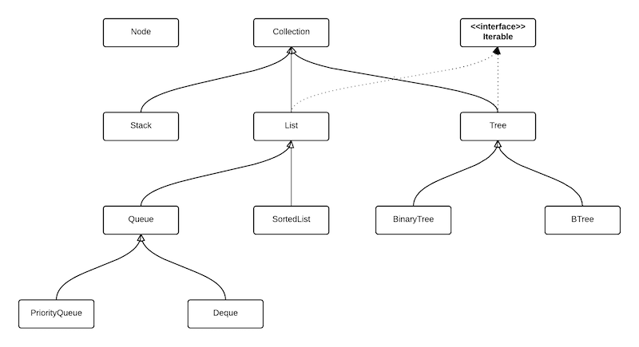

# util.ds

> Simple data structures

[](https://circleci.com/gh/jmquigley/util.ds/tree/master)
[](https://palantir.github.io/tslint/)
[](https://github.com/prettier/prettier)
[](https://facebook.github.io/jest/)
[](https://www.npmjs.com/package/util.ds)
[](https://coveralls.io/github/jmquigley/util.ds?branch=master)

This module contains my implementation of a few basic data structures using [Typescript](https://www.typescriptlang.org/).  I could have used other implementations, but what fun is that.

It contains the following data structures:

- [BinaryTree](docs/lib/binarytree.md)
- [Deque](docs/lib/deque.md)
- [GeneralTree](docs/lib/generaltree.md)
- [List](docs/lib/list.md)
- [PriorityQueue](docs/lib/priorityqueue.md)
- [Queue](docs/lib/queue.md)
- [SortedList](docs/lib/sortedlist.md)
- [Stack](docs/lib/stack.md)



(image created with [Lucidchart](https://www.lucidchart.com))


## Installation

This module uses [yarn](https://yarnpkg.com/en/) to manage dependencies and run scripts for development.

To install as an application dependency:
```
$ yarn add --dev util.ds
```

To build the app and run all tests:
```
$ yarn run all
```


## Usage

### [BinaryTree](docs/lib/binarytree.md)
A binary search tree implemented using the Red/Black algorithm from [Introduction to Algorithms - Cormen 3rd ed.](https://www.amazon.com/Introduction-Algorithms-3rd-MIT-Press/dp/0262033844).

```javascript
import {BinaryTree} from 'util.ds';

const bt = new BinaryTree<string>(['a', 'c', 'g']);

bt.insert('d');
bt.insert('k');

//     C
//    / \
//   A   G
//      / \
//     D   K

// bt.length === 5
// bt.first === 'a'
// bt.last === 'k'
// bt.height === 3

console.log(bt.contains('d'));

// true

console.log(bt.contains('z'));

// false

console.log(bt.breadthSearch('d'));

// true

console.log(bt.inorder);

// ['a', 'c', 'd', 'g', 'k']

console.log(bt.preorder);

// ['c', 'a', 'g', 'd', 'k']

console.log(bt.postorder);

// ['a', 'd', 'k', 'g', 'c']

console.log(bt.breadth);

// ['c', 'a', 'g', 'd', 'k']

for (const val of bt) {
    console.log(`${val} `);
}

// inorder, iterator though each node in the tree
// a c d g k

console.log(bt.find('g'));

// g

bt.delete('g');

//     C
//    / \
//   A   K
//      /
//     D

bt.delete('c');

//     D
//    / \
//   A   K

bt.clear();

// bt.length === 0
// bt.first === nil
// bt.last === nil
// bt.height === 0

```

The output above demonstrates all of the basic operations used to interact with the tree.  When an element is added to the tree an `insert` event fires.  When an element is deleted from the tree a `remove` event fires.


### [GeneralTree](docs/lib/generaltree.md)
A general tree is an implementation where each parent can have an arbitrany number of child nodes wtihin it (including the root node).

```javascript
import {Comparator, GeneralTree, GeneralTreeItem} from 'util.ds';

interface TestData {
    field1? string;
}

const comparator: Comparator<TestData> = (
	o1: TestData,
	o2: TestData
): number => {
	if (o1.field1 === o2.field1) {
		return 0;
	}

	return -1;
};

const gt = new GeneralTree<TestData>({}, comparator);

gt.insert({id: 0, field1: "f1"});
gt.insert({id: 1, field1: "f2"});
gt.insert({id: 2, field1: "f3", parentId: 0});
gt.insert({id: 3, field1: "f4", parentId: 0});
gt.insert({id: 4, field1: "f5", parentId: 0});
gt.insert({id: 5, field1: "f6"});


//        f1, f2, f6     # root
//       / | \
//     f3 f4  f5         # children of f1

// gt.length === 6
// gt.first === {id: 0, field: "f1"}
// gt.last === {id: 5, field: "f6"}
// gt.height === 2
```

The methods above would create a simple general tree that holds an object of type `TestData`.  The root of the three contains three nodes "f1, f2, f6".  At each level of the tree an arbitrary number of children can be inserted into that parent node.  In the example above the "f1" parent node contains three children "f3,f4,f5".  Also note that the `id` fields are explicityly set for each node on insert.  These can be omitted.  When not given, then the tree will generate a UUID for each node.  There are no balancing operations for this tree.  The tree can be searched using the following methods:

```javascript

console.log(gt.contains({field1: "f1"}));

// true

console.log(gt.contains({field1: "foo"}));

// false

console.log(gt.find(2));

// {id: 2, field1: "f3"}

console.log(gt.findByParent(0))

// [{field1: "f3"}, {field1: "f4}, {field1: "f5"}]
//
// note that the objects in the array above do NOT show all fields returned.  These objects contain a reference
// to their parent and associated id values.

console.log(gt.findByField({field1: "f3"}));

// [{field1: "f3", id: 2, parentId: 0}]
```

Nodes can be removed from the tree by their id value:

```javascript

gt.remove(0, true);

// attempts to remove "f1", but this flag will prevent removal of nodes with children

gt.remove(0);

// removes "f1" and all of its child nodes
```

To iterate through the whole tree use the walk function.  It will perform an inorder traversal of the nodes in the tree and execute a callback method as it touches each node in the tree:

```javascript

gt.walk((it: GeneralTreeItem) => {
    // do something with node saved in "it"
});
```


### [Deque](docs/lib/deque.md)
A deque is a double ended queue.  An element can be inserted at either end of the queue.

```javascript
import {Deque} from 'util.ds';

const q = new Deque<number>();

q.enqueue(1);
let val = q.dequeue();
```

This example works like a typical queue.  However this type allows one to add items at either end.

When an element is added to the deque an `insert` event fires.  When an element is removed from the deque a `remove` event fires.

The deque can have items added to either end:

```javascript
import {Deque} from 'util.ds';

const q = new Deque<number>();

q.pushFront(1);
q.pushBack(2);

let val = q.popFront();
val = q.popBack();
```

A deque can also be limited in size:

```javascript
import {Deque} from 'util.ds';

const q = new Deque<number>(5);
for (let i: number = 0; i < 5; i++) {
	q.enqueue(i);
}

q.enqueue(6);
```

This will add 5 items to the queue.  The last item adds a 6th element.  That will cause the first item in the queue to be removed automatically before the new item is enqueued.  This provides a way to "age" items within the queue.  When the item is removed a `remove` event fires.  The front item in the queue is considered the oldest item.


### [List](docs/lib/list.md)

A doubly linked list structure.  To create a list and insert elements use:

```javascript
import {List} from 'util.ds';

const list = new List<string>();

list.insert('a');
list.insert('b');
list.insert('c');

// list.size === 3
// list.front === 'a'
// list.back === 'c'

console.log(list.array);

// ['a', 'b', 'c']

for (const it of list) {
    console.log(it);
}

// a
// b
// c

console.log(list.reverse);

// ['c', 'b', 'a']

list.remove('b');
console.log(list.array);

// ['a', 'c']

console.log(list.contains('a'));

// true

console.log(list.contains('b'));

// false

```

When an element is added to the list an `insert` event fires.  When an element is removed from the list a `remove` event fires.


### [PriorityQueue](docs/lib/priqueue.md)

Uses a Red/Black binary tree to implement a priority queue.  Items are inserted into a queue structure with an associatd priority number.  The lower the number, the higher the priority.  Items with a higher priority are chosen first in the queue.  Priority values are numbers > 0.  If a negative number is given, then it will be given a priority of 0.

To create a priority queue use:

```javascript
import {PriorityQueue} from 'util.ds';

const pq = new PriorityQueue<string>();

pq.enqueue('a', 100);
pq.enqueue('b', 10);
pq.enqueue('c', 50);

console.log(pq.size);

// 3

console.log(pq.dequeue());

// 'b'

console.log(pq.dequeue());

// 'c'

console.log(pq.dequeue());

// 'a'
```

When an element is added to the queue an `insert` event fires.  When an element is removed from the queue a `remove` event fires.


### [Queue](docs/lib/queue.md)
To create a simple queue use:

```javascript
import {Queue} from 'util.ds';

const q = new Queue<number>();

q.enqueue(1);
let val = q.dequeue();
```

When an element is added to the queue an `insert` event fires.  When an element is removed from the queue a `remove` event fires.

A queue can also be *drained*.  This will dequeue all items from the list and place them into an array which is returned to the caller.

```javascript
import {Queue} from 'util.ds';

const q = new Queue<number>([1, 2, 3, 4, 5]);

// q.size === 5

console.log(q.dequeue());

// 1

console.log(q.drain());

// [2, 3, 4, 5]
//
// q.size === 0
```

When the queue is drained a `drain` event is emitted.


### [SortedList](docs/lib/sortedlist.md)

The `SortedList` is similar to the `List` structure above.  The difference is that the `insert` operation will place the value its ascending order location.  It presents all of the same properties and methods.

```javascript
import {SortedList} from 'util.ds';

const list = new SortedList<string>();

list.insert('b');
list.insert('a');
list.insert('c');

console.log(list.array);

// ['a', 'b', 'c']
```

When an element is added to the list an `insert` event fires.  When an element is removed from the list a `remove` event fires.


### [Stack](docs/lib/stack.md)
To create a simple stack use:

```javascript
import {Stack} from 'util.ds';

const stack = new Stack<number>();

stack.push(1);
stack.push(2);
stack.push(3);

console.log(stack.top());

// 3

console.log(stack.pop());

// 3
```

When an element is added to the stack an `insert` event fires.  When an element is removed from the stack a `remove` event fires.


## Comparators

These data structures work with primitive data types by default.  Each object can also accept a user defined data type.  This requires a [Comparator](docs/lib/comparator.md) object to define how two user defined objects can be compared.

```javascript
import {BinaryTree, Comparator} from 'util.ds'

interface TestData {
	key: string;
	data?: number;
}

const fn: Comparator<TestData> = (o1: TestData, o2: TestData): number => {
	if (o1.key === o2.key) {
		return 0;
	} else if (o1.key > o2.key) {
		return 1;
	}

	return -1;
};

const bt = new BinaryTree<TestData>(null, fn);

bt.insert({key: 'g', data: 1});
bt.insert({key: 'c', data: 2});
bt.insert({key: 'a', data: 3});
bt.insert({key: 'd', data: 4});
bt.insert({key: 'k', data: 5});

console.log(bt.find({key: 'g'}).data);

// 1
```
