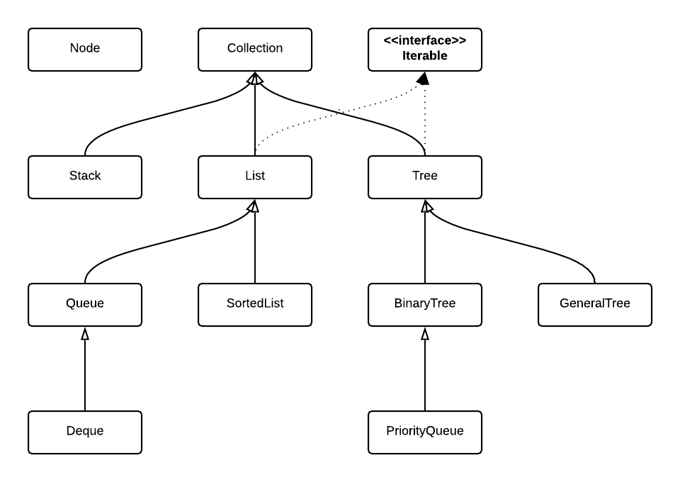

# util.ds [](https://travis-ci.org/jmquigley/util.ds) [](https://palantir.github.io/tslint/) [](https://github.com/avajs/ava) [](https://www.npmjs.com/package/util.ds) [](https://coveralls.io/github/jmquigley/util.ds?branch=master)

> Simple data structures

This module contains my implementation of a few basic data structures using [Typescript](https://www.typescriptlang.org/).  I could have used other implementations, but what fun is that.

It Contains the following data structures:

- [BinaryTree](docs/lib/binarytree.md)
- [Deque](docs/lib/deque.md)
- [List](docs/lib/list.md)
- [PriorityQueue](docs/lib/priqueue.md)
- [Queue](docs/lib/queue.md)
- [SortedList](docs/lib/sortedlist.md)
- [Stack](docs/lib/stack.md)



(image created with [Lucidchart](https://www.lucidchart.com))


## Installation

To install as an application dependency:
```
$ npm install --save util.ds
```

To build the app and run all tests:
```
$ npm run all
```


## Usage

### BinaryTree
A binary search tree implemented using the Red/Black algorithm from [Introduction to Algorithms - Cormen 3rd ed.](https://www.amazon.com/Introduction-Algorithms-3rd-MIT-Press/dp/0262033844).

```javascript
import {BinaryTree} from 'util.ds';

const bt = new BinaryTree<string>(['a', 'c', 'g']);

bt.insert('d');
bt.insert('k');

//     C
//    / \
//   A   G
//      / \
//     D   K

// bt.length === 5
// bt.first === 'a'
// bt.last === 'k'
// bt.height === 3

console.log(bt.contains('d'));

// true

console.log(bt.contains('z'));

// false

console.log(bt.breadthSearch('d'));

// true

console.log(bt.inorder);

// ['a', 'c', 'd', 'g', 'k']

console.log(bt.preorder);

// ['c', 'a', 'g', 'd', 'k']

console.log(bt.postorder);

// ['a', 'd', 'k', 'g', 'c']

console.log(bt.breadth);

// ['c', 'a', 'g', 'd', 'k']

for (const val of bt) {
    console.log(`${val} `);
}

// inorder, iterator though each node in the tree
// a c d g k

bt.delete('g');

//     C
//    / \
//   A   K
//      /
//     D

bt.delete('c');

//     D
//    / \
//   A   K

bt.clear();

// bt.length === 0
// bt.first === nil
// bt.last === nil
// bt.height === 0

```

The output above demonstrates all of the basic operations used to interact with the tree.  When an element is added to the tree an `insert` event fires.  When an element is deleted from the tree a `delete` event fires.


### Deque
A deque is a double ended queue.  An element can be inserted at either end of the queue.

```javascript
import {Deque} from 'util.ds';

const q = new Deque<number>();

q.enqueue(1);
let val = q.dequeue();
```

This example works like a typical queue.  However this type allows one to add items at either end.

When an element is added to the deque an `add` event fires.  When an element is removed from the deque a `remove` event fires.

The deque can have items added to either end:

```javascript
import {Deque} from 'util.ds';

const q = new Deque<number>();

q.pushFront(1);
q.pushBack(2);

let val = q.popFront();
val = q.popBack();
```

A deque can also be limited in size:

```javascript
import {Deque} from 'util.ds';

const q = new Deque<number>(5);
for (let i: number = 0; i < 5; i++) {
	q.enqueue(i);
}

q.enqueue(6);
```

This will add 5 items to the queue.  The last item adds a 6th element.  That will cause the first item in the queue to be removed automatically before the new item is enqueued.  This provides a way to "age" items within the queue.  When the item is removed a `remove` event fires.  The front item in the queue is considered the oldest item.


### List

TODO: Add doubly linked list to implementation


### PriorityQueue

TODO: Add a priority queue to the implementation


### Queue
To create a simple queue use:

```javascript
import {Queue} from 'util.ds';

const q = new Queue<number>();

q.enqueue(1);
let val = q.dequeue();
```

When an element is added to the queue an `add` event fires.  When an element is removed from the queue a `remove` event fires.


### SortedList

TODO: Add a sorted list to the implementation


### Stack
To create a simple stack use:

```javascript
import {Stack} from 'util.ds';

const stack = new Stack<number>();

stack.push(1);
stack.push(2);
stack.push(3);

console.log(stack.top());

// 3

console.log(stack.pop());

// 3
```

When an element is added to the stack an `add` event fires.  When an element is removed from the stack a `remove` event fires.
